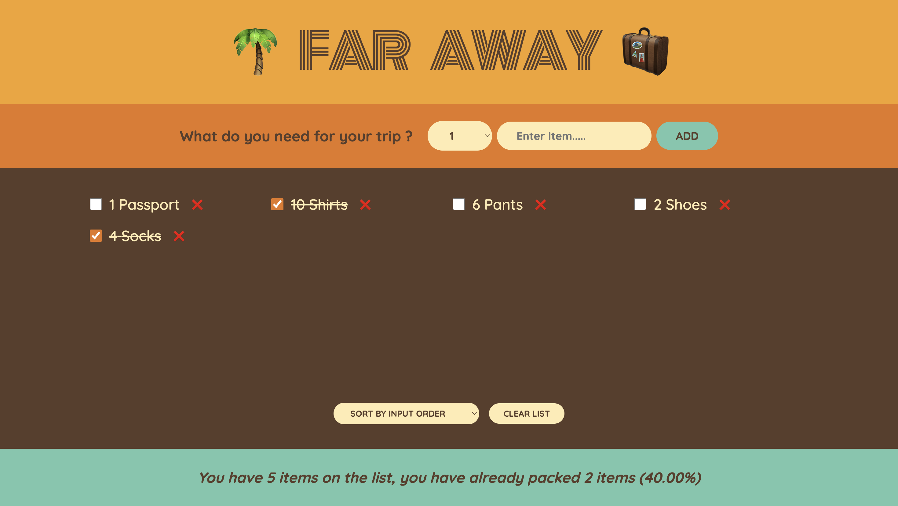

# Far Away Packing List App

**Far Away** is a simple travel packing list app created as part of a learning exercise to understand and maximize the use of **React** and **useState** for state management. The app allows users to add items to their packing list, mark them as packed, and dynamically see the percentage of items they have packed so far. It also includes options to sort the list and clear it when needed.

## Features

- **Add items**: Specify an item and the quantity you need for your trip.
- **Track packing progress**: Check off items as you pack them, and the app updates the progress bar to reflect your progress (e.g., "50.00% packed").
- **Remove items**: Easily delete items from the list if they are not needed.
- **Sort items**: Sort the packing list by the order in which items were added.
- **Clear list**: Quickly clear all items from the packing list to start fresh.

## Learning Objectives

- **useState**: The app makes extensive use of useState to track multiple states including the packing list, individual items, and packing progress.
- **Dynamic UI**: The app updates in real-time as the user interacts with the list, using React's stateful components to re-render efficiently.
- **Conditional Rendering**: The app conditionally renders packed items with a strikethrough effect to visually indicate what has already been packed.

## How It Works

1.  **Adding items**: Enter an item name and quantity, and click the "Add" button. The item will appear in the list below with a checkbox and a remove (X) button.
2.  **Packing items**: Check the box next to an item to mark it as packed. The total packed items count and percentage will update accordingly.
3.  **Removing items**: Click the "X" button next to an item to remove it from the list.
4.  **Sorting and clearing**: Use the "Sort" button to organize items by the order they were added, and click "Clear List" to remove all items.

This app is a great example of how React's state management can be used to create a dynamic and interactive user interface. The use of useState allows for granular control over different aspects of the app, from tracking individual items to updating packing progress in real time.

## Screenshot

[!img()]
